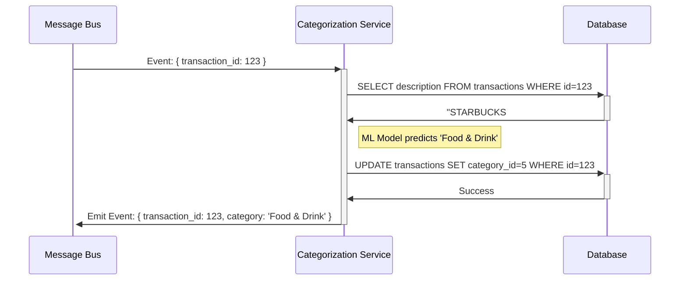

# Design Specification: [feature_name]

## Overview
[What is the feature? What is the purpose?]

## User Story
As a **[user type]**, I want **[capability]**, so that **[benefit]**.

## Key Requirements
* **[FR-1]:** [1 sentence description of the requirement]
* **[FR-2]:** [1 sentence description of the requirement]
* **[FR-3]:** [1 sentence description of the requirement]
* [Add more as needed, limit to 5]

## Technical Approach
[What is the technical approach? What are the steps?]
```mermaid
[Diagram of the technical approach]
```

## Acceptance Criteria (BDD Format)
- [ ] **GIVEN** [context] **WHEN** [action] **THEN** [outcome]
- [ ] **GIVEN** [context] **WHEN** [action] **THEN** [outcome]
- [ ] [Add more as needed]

## Constraints & Guidelines
- Must follow existing [specify patterns from tech/structure specs]
- Reuse [specify existing components/utilities]
- Performance: [Any specific requirements]
- Security: [Any specific considerations]

## Component Interaction Diagram
[Are their any new components? What are the components and how do they interact?]
```mermaid
[Diagram of the component interaction]
```
<!--
Example:

-->

## Data Models

### Model 1
```yaml
[Define the structure of Model1 in your language]
- id: [unique identifier type]
- name: [string/text type]
- [Additional properties as needed]
```

### Model 2
```yaml
[Define the structure of Model2 in your language]
- id: [unique identifier type]
- [Additional properties as needed]
```