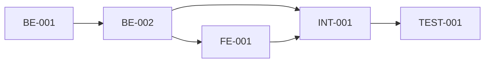

# Task Specification: [feature_name]

## Overview
[Brief description of the implementation plan and task breakdown strategy]

## Task Instructions

### Backend Tasks

#### [task_id] [Task Name] <!-- [BE-001] Categorization of transactions -->
  - [Bullet 1: Specific action to take]
  - [Bullet 2: Key implementation detail]
  - [Bullet 3: Validation or testing requirement]

#### [task_id] [Task Name] <!-- [BE-002] Validation of transactions -->
  - [Bullet 1: Specific action to take]
  - [Bullet 2: Key implementation detail]

### Frontend Tasks

#### [task_id] [Task Name] <!-- [FE-001] UI/UX design for transactions -->
  - [Bullet 1: Specific action to take]
  - [Bullet 2: Key implementation detail]
  - [Bullet 3: UI/UX consideration]

### Integration Tasks

#### [task_id] [Task Name] <!-- [INT-001] Integration of transactions -->
  - [Bullet 1: Specific action to take]
  - [Bullet 2: Key integration point]

### Testing Tasks

#### [task_id] [Task Name] <!-- [TEST-001] Testing of transactions -->
  - [Bullet 1: Test coverage requirement]
  - [Bullet 2: Specific test scenarios]
  - [Bullet 3: Performance benchmark if applicable]

## Execution Order

## Risk Factors
- **[Risk 1]:** [Brief description and mitigation]
- **[Risk 2]:** [Brief description and mitigation]

## Success Criteria
- [ ] All tasks completed and checked
- [ ] Unit test coverage > [threshold]%
- [ ] Integration tests passing
- [ ] Code review approved
- [ ] Acceptance criteria from DS-[design_spec_id] met

## Notes
[Any additional context or special considerations for implementation]