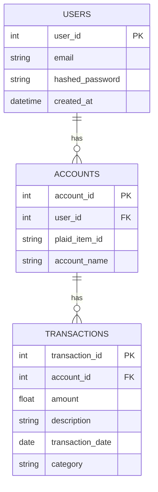

# Technology Specification: [project_name]

## Core Technologies

### Technology Stack

A curated list of the primary technologies.

| Category          | Technology / Framework  | Version | Justification                                    |
| ----------------- | ----------------------- | ------- | ------------------------------------------------ |
<!--
Example:
| **Frontend** | React                   | 18.x    | Industry standard, large ecosystem.              |
|                   | Vite                    | 5.x     | Modern, fast build tooling.                      |
| **Backend** | Python                  | 3.11+   | Excellent for data processing and AI/ML.         |
|                   | FastAPI                 | 0.100+  | High performance, async support, auto-docs.      |
| **Data Storage** | PostgreSQL              | 15.x    | Robust, reliable, and great for relational data. |
|                   | Redis                   | 7.x     | Caching and session storage.                     |
| **Messaging** | Kafka                   | 3.x     | Scalable event streaming for microservices.      |
| **Infrastructure**| Docker                  | 24.x    | Containerization for consistent environments.    |
|                   | Kubernetes (on AWS EKS) | 1.28    | Container orchestration for scalability.         |
| **CI/CD** | GitHub Actions          | -       | Native integration with our source control.      |
-->

### Key Dependencies/Libraries & Services

[List the main libraries and frameworks your project depends on]
- **[Library/Framework name]**: [Purpose and version]
- **[Library/Framework name]**: [Purpose and version]

<!--
Example:
* **Pandas:** Data processing; version 2.2.3
* **SQLAlchemy:** ORM for Python services; version 2.0.0
* **Plaid API:** Bank integration; version 2.0.0
* **Auth0:** Authentication; version 2.0.0
* **Amazon Web Services (AWS):** Cloud provider; version 2.0.0
-->

## Data Storage
- **Primary storage**: [e.g., PostgreSQL, files, in-memory, cloud storage]
- **Caching**: [e.g., Redis, in-memory, disk cache]
- **Data formats**: [e.g., JSON, Protocol Buffers, XML, binary]

### Data Schema (ERD)

<!--
Example:
A Mermaid ERD showing the primary data entities and their relationships.

-->

## External Integrations (if applicable)
- **APIs**: [External services you integrate with]
- **Protocols**: [e.g., HTTP/REST, gRPC, WebSocket, TCP/IP]
- **Authentication**: [e.g., OAuth, API keys, certificates]

## Monitoring & Dashboard Technologies (if applicable)
- **Dashboard Framework**: [e.g., React, Vue, vanilla JS, terminal UI]
- **Real-time Communication**: [e.g., WebSocket, Server-Sent Events, polling]
- **Visualization Libraries**: [e.g., Chart.js, D3, terminal graphs]    
- **State Management**: [e.g., Redux, Vuex, file system as source of truth]

## Development Environment

### Build & Development Tools
- **Build System**: [e.g., Make, CMake, Gradle, npm scripts, cargo]
- **Package Management**: [e.g., pip, npm, cargo, go mod, apt, brew]
- **Development workflow**: [e.g., hot reload, watch mode, REPL]

### Code Quality Tools
- **Static Analysis**: [Tools for code quality and correctness]
- **Formatting**: [Code style enforcement tools]
- **Testing Framework**: [Unit, integration, and/or end-to-end testing tools]
- **Documentation**: [Documentation generation tools]

### Version Control & Collaboration
- **VCS**: [e.g., Git, Mercurial, SVN]
- **Branching Strategy**: [e.g., Git Flow, GitHub Flow, trunk-based]
- **Code Review Process**: [How code reviews are conducted]

### Dashboard Development (if applicable)
- **Live Reload**: [e.g., Hot module replacement, file watchers]
- **Port Management**: [e.g., Dynamic allocation, configurable ports]
- **Multi-Instance Support**: [e.g., Running multiple dashboards simultaneously]

## Deployment & Distribution (if applicable)
- **Target Platform(s)**: [Where/how the project runs: cloud, on-premise, desktop, mobile, embedded]
- **Distribution Method**: [How users get your software: download, package manager, app store, SaaS]
- **Installation Requirements**: [Prerequisites, system requirements]
- **Update Mechanism**: [How updates are delivered]

## Technical Decisions & Rationale
[Document key architectural and technology choices]

### Decision Log
1. **[Technology/Pattern Choice]**: [Why this was chosen, alternatives considered]
2. **[Architecture Decision]**: [Rationale, trade-offs accepted]
3. **[Tool/Library Selection]**: [Reasoning, evaluation criteria]

## Known Limitations
[Document any technical debt, limitations, or areas for improvement]

- [Limitation 1]: [Impact and potential future solutions]
- [Limitation 2]: [Why it exists and when it might be addressed]